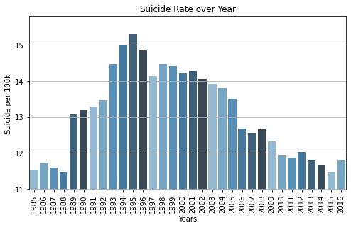
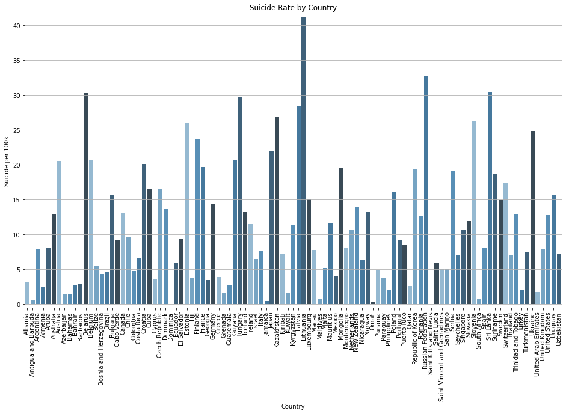
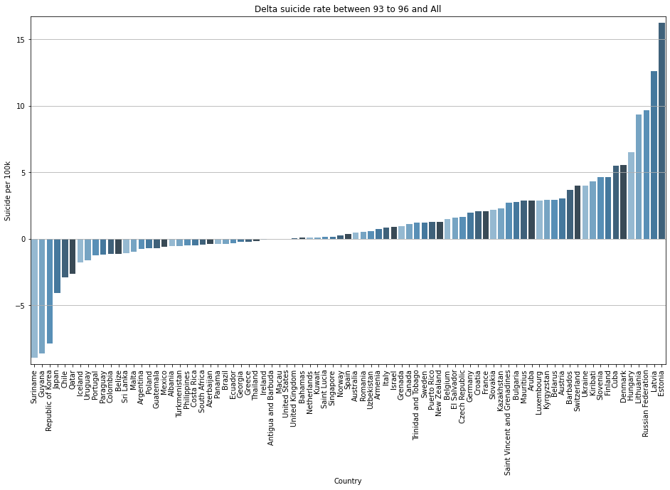
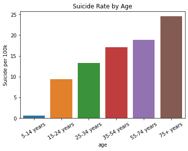
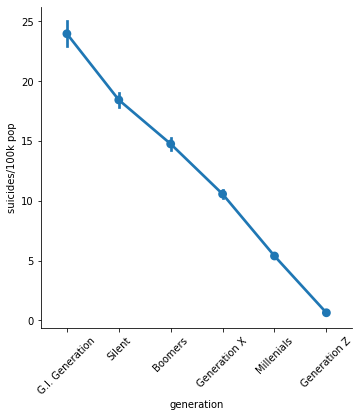
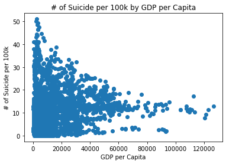
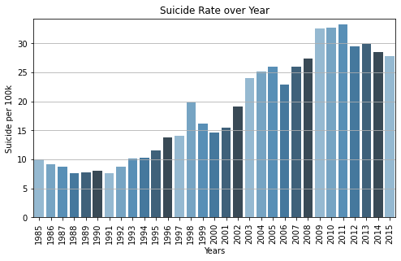
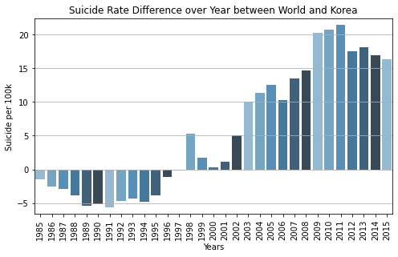
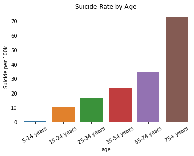
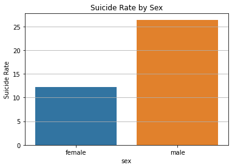

## 0. 라이브러리 & Dataset


```python
import numpy as np
import pandas as pd
import matplotlib.pyplot as plt
import seaborn as sns

%matplotlib inline
```

### Dataset : Suicide Rates Overview 1985 to 2016 from kaggle

- 국가별 자살률과 자살률에 미치는 유의미한 변수를 확인한다.


```python
suicide_df = pd.read_csv("./master.csv")
```


```python
suicide_df.head()
```


<div>
<style scoped>
    .dataframe tbody tr th:only-of-type {
        vertical-align: middle;
    }

    .dataframe tbody tr th {
        vertical-align: top;
    }

    .dataframe thead th {
        text-align: right;
    }
</style>
<table border="1" class="dataframe">
  <thead>
    <tr style="text-align: right;">
      <th></th>
      <th>country</th>
      <th>year</th>
      <th>sex</th>
      <th>age</th>
      <th>suicides_no</th>
      <th>population</th>
      <th>suicides/100k pop</th>
      <th>country-year</th>
      <th>HDI for year</th>
      <th>gdp_for_year ($)</th>
      <th>gdp_per_capita ($)</th>
      <th>generation</th>
    </tr>
  </thead>
  <tbody>
    <tr>
      <th>0</th>
      <td>Albania</td>
      <td>1987</td>
      <td>male</td>
      <td>15-24 years</td>
      <td>21</td>
      <td>312900</td>
      <td>6.71</td>
      <td>Albania1987</td>
      <td>NaN</td>
      <td>2,156,624,900</td>
      <td>796</td>
      <td>Generation X</td>
    </tr>
    <tr>
      <th>1</th>
      <td>Albania</td>
      <td>1987</td>
      <td>male</td>
      <td>35-54 years</td>
      <td>16</td>
      <td>308000</td>
      <td>5.19</td>
      <td>Albania1987</td>
      <td>NaN</td>
      <td>2,156,624,900</td>
      <td>796</td>
      <td>Silent</td>
    </tr>
    <tr>
      <th>2</th>
      <td>Albania</td>
      <td>1987</td>
      <td>female</td>
      <td>15-24 years</td>
      <td>14</td>
      <td>289700</td>
      <td>4.83</td>
      <td>Albania1987</td>
      <td>NaN</td>
      <td>2,156,624,900</td>
      <td>796</td>
      <td>Generation X</td>
    </tr>
    <tr>
      <th>3</th>
      <td>Albania</td>
      <td>1987</td>
      <td>male</td>
      <td>75+ years</td>
      <td>1</td>
      <td>21800</td>
      <td>4.59</td>
      <td>Albania1987</td>
      <td>NaN</td>
      <td>2,156,624,900</td>
      <td>796</td>
      <td>G.I. Generation</td>
    </tr>
    <tr>
      <th>4</th>
      <td>Albania</td>
      <td>1987</td>
      <td>male</td>
      <td>25-34 years</td>
      <td>9</td>
      <td>274300</td>
      <td>3.28</td>
      <td>Albania1987</td>
      <td>NaN</td>
      <td>2,156,624,900</td>
      <td>796</td>
      <td>Boomers</td>
    </tr>
  </tbody>
</table>
</div>


- contry-year는 의미없는 column이므로 제거한다


```python
suicide_df.info()
```

    <class 'pandas.core.frame.DataFrame'>
    RangeIndex: 27820 entries, 0 to 27819
    Data columns (total 12 columns):
     #   Column              Non-Null Count  Dtype  
    ---  ------              --------------  -----  
     0   country             27820 non-null  object 
     1   year                27820 non-null  int64  
     2   sex                 27820 non-null  object 
     3   age                 27820 non-null  object 
     4   suicides_no         27820 non-null  int64  
     5   population          27820 non-null  int64  
     6   suicides/100k pop   27820 non-null  float64
     7   country-year        27820 non-null  object 
     8   HDI for year        8364 non-null   float64
     9    gdp_for_year ($)   27820 non-null  object 
     10  gdp_per_capita ($)  27820 non-null  int64  
     11  generation          27820 non-null  object 
    dtypes: float64(2), int64(4), object(6)
    memory usage: 2.5+ MB
    


```python
del suicide_df['country-year']
```

- HDI(Human Development Index)는 UN에서 발표하는 값으로, 각국의 인간 발전정도와 선진화 정도를 평가한 지수이다. 소득지수와 기대수명지수, 교육지수등을 사용한다.
- 하지만 null의 비중이 70%에 육박하므로 정상적으로 분석을 수행하기 어려울 것이다.
- 따라서 제거한다.


```python
suicide_df['HDI for year'].isnull().mean()
```


    0.699352983465133


```python
del suicide_df['HDI for year']
```


```python
suicide_df.isnull().sum()
```


    country               0
    year                  0
    sex                   0
    age                   0
    suicides_no           0
    population            0
    suicides/100k pop     0
     gdp_for_year ($)     0
    gdp_per_capita ($)    0
    generation            0
    dtype: int64


- 다행히 더이상의 결측치는 없다.

## 1. 전 세계 자살율과 국가별 자살률

### 1.1 연도별 전세계 자살율


```python
## 연도별 Data를 뽑기위해 'year'로 묶어준다
suicide_df_year = suicide_df.groupby(['year'])
## 10만명당 자살율을 계산한다
suicide_rate_by_year = (suicide_df_year['suicides_no'].sum() / suicide_df_year['population'].sum()) * 100000

plt.figure(figsize=(8,4.5))
my_palette = sns.color_palette('Blues_d')
sns.barplot(x=suicide_rate_by_year.index, y=suicide_rate_by_year.values, palette = my_palette)
plt.xticks(rotation=90)
plt.ylim(min(suicide_rate_by_year.values)-0.5,max(suicide_rate_by_year.values)+0.5)
plt.xlabel('Years')
plt.ylabel('Suicide per 100k')
plt.title("Suicide Rate over Year")
plt.grid(True, axis='y')
plt.show()
```


    

    


- 1995년의 10만명당 자살율이 가장 높으며, 1995년 전후로 자살율이 높은 것을 볼 수 있다
- 이시기에 어떤 국가들이 자살율이 높은지를 확인하면 그시기에 어떤 사건이 영향을 미쳤는지 알 수 있을것이다. 
- 우선 통계기간의 국가별 자살율을 확인해보자.

### 1.2 국가별 자살율


```python
suicide_df_country = suicide_df.groupby(['country'])
suicide_rate_by_country = (suicide_df_country['suicides_no'].sum() / suicide_df_country['population'].sum()) * 100000

plt.figure(figsize=(16,9))
my_palette = sns.color_palette('Blues_d')
sns.barplot(x=suicide_rate_by_country.index, y=suicide_rate_by_country.values, palette = my_palette)
plt.xticks(rotation=90)
plt.ylim(min(suicide_rate_by_country.values)-0.5,max(suicide_rate_by_country.values)+0.5)
plt.xlabel('Country')
plt.ylabel('Suicide per 100k')
plt.title('Suicide Rate by Country')
plt.grid(True, axis='y')
plt.show()
```


    

    


- 이제 자살율이 높았던 1993~1996년도의 자살율과 전체 자살율과의 차이를 그래프로 그려보겠다.
- 이렇게하면 평균보다 해당 시기에 얼마나 자살을 더 많이 했는지를 알 수 있을것이다.

### 1.3 전체 년도의 자살율과 93~96년 자살율과의 차이


```python
suicide_df_9396_country = suicide_df.loc[(1993<= suicide_df['year']) & (1996 >= suicide_df['year'])].groupby(['country'])
suicide_rate_by_country_9396 = (suicide_df_9396_country['suicides_no'].sum() / suicide_df_9396_country['population'].sum()) * 100000
suicide_diff_rate = suicide_rate_by_country_9396 - suicide_rate_by_country
suicide_diff_rate.dropna(inplace= True)
sorted_rate = suicide_diff_rate.sort_values()

plt.figure(figsize=(16,9))
my_palette = sns.color_palette('Blues_d')
sns.barplot(x=sorted_rate.index, y=sorted_rate.values, palette = my_palette)
plt.xticks(rotation=90)
plt.ylim(min(sorted_rate.values)-0.5,max(sorted_rate.values)+0.5)
plt.xlabel('Country')
plt.ylabel('Suicide per 100k')
plt.title('Delta suicide rate between 93 to 96 and All')
plt.grid(True, axis='y')
plt.show()
```


    

    


- Estonia, Latvia, Russian Federation, Lithuania에서 값이 높게 나왔다.
- 위 국가들 모두 91년 소련으로부터 독립하거나, 소련을 계승하여 발생한 국가이다.
- 실제 소련군대가 모두 철수한것은 94년의 일이라고하니, 불안한 정세가 영향을 미쳤을 가능성이 있다.

## 2. 연령 및 성별에 따른 자살율
### 2.1 연령에 따른 자살율


```python
suicide_by_age = suicide_df.groupby(['age'])
suicide_rate_by_age = (suicide_by_age['suicides_no'].sum() / suicide_by_age['population'].sum()) * 100000
suicide_rate_by_age.sort_values(inplace=True)

sns.barplot(x=suicide_rate_by_age.index, y=suicide_rate_by_age.values)
plt.xticks(rotation=30)
plt.ylabel('Suicide per 100k')
plt.title('Suicide Rate by Age')
plt.show()
```


    

    


- 전세계적으로 연령이 높을수록 자살율이 높게 나타났다.
- 노인이 자살을 생각하게 되는 주요원인으로는 '경제적 어려움', '건강', '외로움', '가족/친구와의 단절', '배우자/친구등의 사망'이 있는 것으로 나타났다. (ref. http://www.samsunghospital.com/home/healthInfo/content/contenView.do?CONT_SRC_ID=33881&CONT_SRC=HOMEPAGE&CONT_ID=6727&CONT_CLS_CD=001027)


### 2.2 성별에 따른 자살율


```python
suicide_by_sex = suicide_df.groupby(['sex'])
suicide_rate_by_sex = (suicide_by_sex['suicides_no'].sum() / suicide_by_sex['population'].sum()) * 100000
print(suicide_rate_by_sex)

sns.barplot(x=suicide_rate_by_sex.index,y=suicide_rate_by_sex.values)
plt.grid(axis='y')
plt.ylabel('Suicide Rate')
plt.title('Suicide Rate by Sex')
plt.show()
```

    sex
    female     5.935839
    male      20.714727
    dtype: float64
    


    

    


- 남성의 자살율이 여성보다 3배가 넘는 수치로 나타났다.
- 한 연구에 따르면 우울수준이 높을수록 자살태도가 높고, 이는 여성보다 남성에게 더 두드러진다. (ref. 강상경/KAHNG， SANG KYOUNG (2010). 우울이 자살을 예측하는가? : 우울과 자살태도 관계의 성별·연령 차이. 사회복지연구, 41( 2), 67- 100. http://www.kci.go.kr/kciportal/landing/article.kci?arti_id=ART001463153#none )
- 즉, 우울에서 자살로 이어지는 경우가 남성이 더 많아 실제 자살율도 높게 나타난 것이다.
---
- 대한민국의 경우 자해 및 자살 시도로 응급실에 내원한 환자의 수는 여성이 55.7%로 44.3%인 남성보다 많다.
- 하지만 전체 자살자중 남성이 차지하는 비율은 72.1%로, 27.9%인 여성보다 많다. (ref. 중앙응급의료센터, 2018 국가응급진료정보망(NEDIS)자료 N2019000015 )
- 이는 자해 및 자살 시도가 성공하는 비율이 남성에게서 더 높게 나타난다고 볼 수 있다.

## 3. 세대에 따른 자살율
- column중 generation이라는 특이한 분류가있어 분석해보고자 한다.

- 각각의 generation은 다음 연도에 출생한 사람들을 의미한다
    - G.I. Generation : 1901 ~ 1927
    - Silent : 1928 ~ 1945
    - Boomers : 1946 ~ 1964
    - Generation X : 1965 ~ 1980
    - Millenials : 1981 ~ 1996
    - Generation Z : 1997 ~ Now


```python
# 오래된 generation부터 신세대 순으로 graph를 그린다.
gen_order = ['G.I. Generation', 'Silent', 'Boomers', 'Generation X', 'Millenials', 'Generation Z' ]
sns.catplot(x='generation', y='suicides/100k pop', kind='point', data=suicide_df, order=gen_order)
plt.xticks(rotation=45)
plt.show()
```


    

    


- 10만명당 자살률이 신세대일수록 떨어지는 것을 볼 수 있다.
- 이는 나이별 자살율과 연관이 있는데, 오래된 세대일수록 나이가 높을것이고, 위 분석에서 확인할 수 있듯이 연령이 높을수록 자살률이 높기 때문이다.
- 예를들어 Millenial 세대와 Z 세대는 각각 최대 40세 / 23세이므로 55세를 초과하는 Boomers나 윗 세대들보다 자살율이 낮다.

## 4. 1인당 GDP(GDP per capita)에따른 자살률


```python
suicide_by_gdppc = suicide_df.groupby(['gdp_per_capita ($)'])
suicide_rate_by_gdppc = (suicide_by_gdppc['suicides_no'].sum() / suicide_by_gdppc['population'].sum()) * 100000

plt.scatter(x = suicide_rate_by_gdppc.index, y = suicide_rate_by_gdppc.values)
plt.xlabel('GDP per Capita')
plt.ylabel('# of Suicide per 100k')
plt.title('# of Suicide per 100k by GDP per Capita')
plt.show()
```


    

    


- 1인당 GDP가 높을수록 자살률이 일정수준 이상으로 높아지지 않는 것을 확인할 수 있다.
- 이는 자살 요인중 하나인 '경제적 어려움'이 제거되기 때문이라 판단 할 수 있다.
- 다만, 1인당 GDP가 낮아도 자살율이 낮은 case가 있으므로, 1인당 GDP와 자살률은 연관성이 없다 할 수 있겠다

## 5. 한국의 경우
### 5.1 한국의 연도별 자살률


```python
# 한국이 포함된 data만을 추출한다
suicide_df_ko = suicide_df[suicide_df['country']=='Republic of Korea']
suicide_df_ko.head()
```


<div>
<style scoped>
    .dataframe tbody tr th:only-of-type {
        vertical-align: middle;
    }

    .dataframe tbody tr th {
        vertical-align: top;
    }

    .dataframe thead th {
        text-align: right;
    }
</style>
<table border="1" class="dataframe">
  <thead>
    <tr style="text-align: right;">
      <th></th>
      <th>country</th>
      <th>year</th>
      <th>sex</th>
      <th>age</th>
      <th>suicides_no</th>
      <th>population</th>
      <th>suicides/100k pop</th>
      <th>gdp_for_year ($)</th>
      <th>gdp_per_capita ($)</th>
      <th>generation</th>
    </tr>
  </thead>
  <tbody>
    <tr>
      <th>20230</th>
      <td>Republic of Korea</td>
      <td>1985</td>
      <td>male</td>
      <td>75+ years</td>
      <td>42</td>
      <td>154800</td>
      <td>27.13</td>
      <td>100,273,097,170</td>
      <td>2731</td>
      <td>G.I. Generation</td>
    </tr>
    <tr>
      <th>20231</th>
      <td>Republic of Korea</td>
      <td>1985</td>
      <td>male</td>
      <td>55-74 years</td>
      <td>393</td>
      <td>1498300</td>
      <td>26.23</td>
      <td>100,273,097,170</td>
      <td>2731</td>
      <td>G.I. Generation</td>
    </tr>
    <tr>
      <th>20232</th>
      <td>Republic of Korea</td>
      <td>1985</td>
      <td>male</td>
      <td>35-54 years</td>
      <td>903</td>
      <td>4285700</td>
      <td>21.07</td>
      <td>100,273,097,170</td>
      <td>2731</td>
      <td>Silent</td>
    </tr>
    <tr>
      <th>20233</th>
      <td>Republic of Korea</td>
      <td>1985</td>
      <td>male</td>
      <td>25-34 years</td>
      <td>655</td>
      <td>3616800</td>
      <td>18.11</td>
      <td>100,273,097,170</td>
      <td>2731</td>
      <td>Boomers</td>
    </tr>
    <tr>
      <th>20234</th>
      <td>Republic of Korea</td>
      <td>1985</td>
      <td>male</td>
      <td>15-24 years</td>
      <td>678</td>
      <td>4413000</td>
      <td>15.36</td>
      <td>100,273,097,170</td>
      <td>2731</td>
      <td>Generation X</td>
    </tr>
  </tbody>
</table>
</div>


```python
suicide_by_year_ko = suicide_df_ko.groupby(['year'])
suicide_rate_by_year_ko = (suicide_by_year_ko['suicides_no'].sum() / suicide_by_year_ko['population'].sum()) * 100000

plt.figure(figsize=(8,4.5))
my_palette = sns.color_palette('Blues_d')
sns.barplot(x=suicide_rate_by_year_ko.index, y=suicide_rate_by_year_ko.values, palette = my_palette)
plt.xticks(rotation=90)
plt.ylim(0,max(suicide_rate_by_year_ko.values)+1.0)
plt.xlabel('Years')
plt.ylabel('Suicide per 100k')
plt.title("Suicide Rate over Year")
plt.grid(True, axis='y')
plt.show()
```


    

    


- 해를 거듭할수록 자살률이 증가하는 것을 볼 수 있다.
- 1998년의 경우 IMF 사태의 영향으로 자살률이 급증했다가 1999년 다시 줄어들었다.


```python
delta_rate_ko = suicide_rate_by_year_ko - suicide_rate_by_year
delta_rate_ko.dropna(inplace=True)

plt.figure(figsize=(8,4.5))
my_palette = sns.color_palette('Blues_d')
sns.barplot(x=delta_rate_ko.index, y=delta_rate_ko.values, palette = my_palette)
plt.xticks(rotation=90)
plt.ylim(min(delta_rate_ko)- 1.0, max(delta_rate_ko.values)+1.0)
plt.xlabel('Years')
plt.ylabel('Suicide per 100k')
plt.title("Suicide Rate Difference over Year between World and Korea")
plt.grid(True, axis='y')
plt.show()
```


    

    


- 1997년 이전에는 전세계의 자살률보다 낮은 자살률을 유지했지만,
- 1998년부터는 전세계의 자살률보다 높은 자살률을 유지하고 있다.

### 5.2 연령 및 성별에 따른 자살률


```python
suicide_by_age_ko = suicide_df_ko.groupby(['age'])
suicide_rate_by_age_ko = (suicide_by_age_ko['suicides_no'].sum() / suicide_by_age_ko['population'].sum()) * 100000
suicide_rate_by_age_ko.sort_values(inplace=True)

sns.barplot(x=suicide_rate_by_age_ko.index, y=suicide_rate_by_age_ko.values)
plt.xticks(rotation=30)
plt.ylabel('Suicide per 100k')
plt.title('Suicide Rate by Age')
plt.show()
```


    

    


```python
suicide_by_sex_ko = suicide_df_ko.groupby(['sex'])
suicide_rate_by_sex_ko = (suicide_by_sex_ko['suicides_no'].sum() / suicide_by_sex_ko['population'].sum()) * 100000
print(suicide_rate_by_sex_ko)

sns.barplot(x=suicide_rate_by_sex_ko.index,y=suicide_rate_by_sex_ko.values)
plt.grid(axis='y')
plt.ylabel('Suicide Rate')
plt.title('Suicide Rate by Sex')
plt.show()
```

    sex
    female    12.204017
    male      26.418308
    dtype: float64
    


    

    


- 75세이상 노인의 자살률이 매우 높게 나타났다. 전체적인 추이는 세계의 연령대별 자살률과 유사하지만, 전체적인 값이 높고, 75세 이상의 노인 자살률이 매우 높게 나타났다.
- 세계와 마찬가지로 남성의 자살률이 여성보다 높게 나타났다


```python

```
